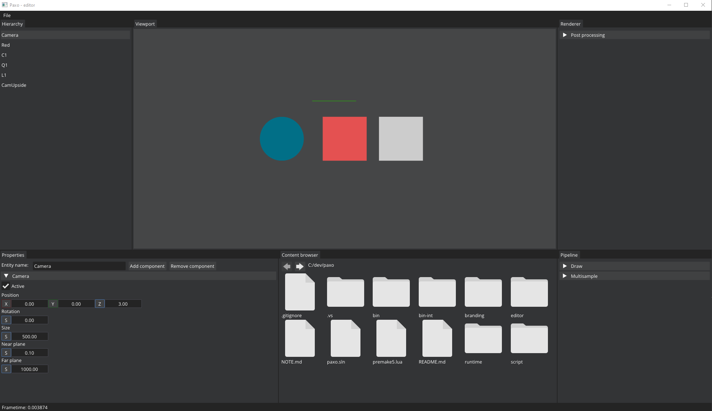

Paxo is an interactive Windows application.

## Features
* `memory utilities` helper functions and containers.
* `math` library for *3D/2D* transformations.
* `ecs` system with serialization and deserialization capabilities.
* `2d-batched-renderer` with 3 primitives and support for tinted-textures.
* `msaa` 4-8-16 samples.

Rendering stages are organized in pipes to provide support for post processing.

## Editor

## Roadmap
* Review input handling. Command pattern.
* Implement multithreading for file loading and rendering-batch creation.
* Panel with async tasks.
* Add networking capabilities.
* Add physics.
